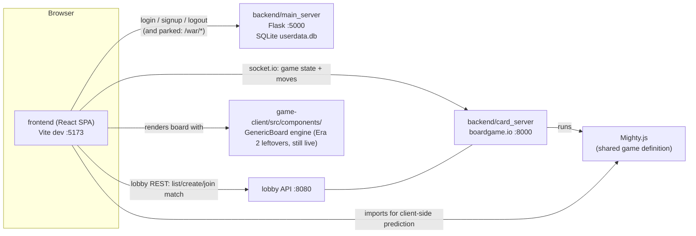

# Project Overview — What Is Actually Going On

## The one-paragraph summary

This repo contains **three generations of the same card-game app stacked on top of each
other**. The live system is: a React SPA ([frontend/](../frontend/)) that talks to a
**boardgame.io** game server ([backend/card_server/](../backend/card_server/)) for the Mighty
card game, and to a small **Flask** server ([backend/main_server/](../backend/main_server/))
for accounts. Two older generations — a Flask-only War game, and a big "generic card game
platform" experiment ([game-client/](../game-client/) + [game-server/](../game-server/)) —
are mostly dead, **except** that the live Mighty board still renders through the old
generation's `GenericBoard` component library. Roughly half the source files in the repo are
unreachable code.

## The three eras (how the repo got this shape)

Understanding the history explains almost every oddity in the code.

### Era 1 — Flask-only War game
The original app: `frontend` (Home/Login screens) + Flask. The game of War is implemented
**server-side in Flask** ([backend/main_server/war_game.py](../backend/main_server/war_game.py))
and the UI is one big component ([frontend/src/War.jsx](../frontend/src/War.jsx)). This still
works, but the "war" screen is currently unreachable (see [02-frontend.md](02-frontend.md)).

### Era 2 — the boardgame.io platform experiment
A large scaffold (much of it clearly AI-generated: `ARCHITECTURE.md`, `README_BOARDGAMEIO.md`,
`start-game-servers.sh`, `.env.example` all document **this** era, not the current code):

- [game-server/](../game-server/) — a boardgame.io server on :8000 registering War, Go Fish,
  and a "custom game" template.
- [game-client/](../game-client/) — a second React app on :3000 with a lobby, a
  drag-and-drop **GenericBoard** component library, and a "playground" where users could
  build custom card games from a rule schema.
- Flask grew `rooms.py`, `playground.py`, and a never-registered `shared_handlers/` package
  to support it.

### Era 3 — Mighty (the current work)
The developer pivoted to building **Mighty** (the Korean trick-taking game) properly:

- [backend/card_server/](../backend/card_server/) — a **new** boardgame.io server (game
  socket :8000, lobby REST :8080) registering only `Mighty`.
- [frontend/src/LobbyComponents/](../frontend/src/LobbyComponents/) — lobby screens inside
  the *original* frontend (list/create/join matches).
- [backend/card_server/GameObjects/Mighty.js](../backend/card_server/GameObjects/Mighty.js) —
  the real Mighty rules (see [03-mighty-game-logic.md](03-mighty-game-logic.md)).
- [frontend/src/board/](../frontend/src/board/) — the Mighty board, which **reuses Era 2's
  `GenericBoard`** via a cross-tree import. This is why `game-client` cannot simply be
  deleted, and why the most recent commit touches both trees.

## The live runtime



Ports:

| Port | What | Status |
|---|---|---|
| 5173 | `frontend` Vite dev server | live |
| 5000 | Flask `main_server` (auth; also war/rooms/playground routes) | live (auth only in practice) |
| 8000 | `backend/card_server` boardgame.io game socket | live |
| 8080 | `backend/card_server` lobby REST API (`lobbyConfig.apiPort`) | live |
| 3000 | `game-client` (Era 2 app) | dead |
| 8000 | `game-server` (Era 2 bgio server — **conflicts with card_server**) | dead |

Note: the 8000/8080 split is *correct* boardgame.io usage (game traffic vs. lobby REST), not
a bug. But `start-game-servers.sh` starts the **Era 2** servers, which don't serve the lobby
API on 8080 — don't use that script with the current app.

## How to run the live system (3 terminals)

```bash
# 1. Flask (accounts). A .venv already exists in backend/main_server.
cd backend/main_server && .venv/bin/python main.py          # → :5000

# 2. boardgame.io server (Mighty)
cd backend/card_server && node server.js                     # → :8000 + lobby :8080

# 3. Frontend
cd frontend && npm run dev                                   # → :5173
```

Then: Sign up / log in → **Play** → lobby screen → *Create Lobby* (Mighty, 5 players) →
you join as player 0. Mighty needs 5 connected players; for solo testing use the boardgame.io
debug panel (visible because `debug: true`) to impersonate other players.

## Directory verdict map

| Path | Verdict | Detail |
|---|---|---|
| `frontend/` | **LIVE** (with dead files inside) | The app. See [02-frontend.md](02-frontend.md) |
| `backend/card_server/` | **LIVE** | The Mighty server. `games.js` + `GameObjects/BoardResources_test.jsx` dead |
| `backend/main_server/` | **LIVE** (half dead) | Auth live; `war_game.py` parked; `rooms.py`/`playground.py` only serve the dead Era 2 client; `shared_handlers/` never registered. See [05-backend.md](05-backend.md) |
| `game-client/` | **SPLIT** | `components/` + `hooks/` + 6 `shared_handlers` hooks are the live board engine ([04-generic-board.md](04-generic-board.md)); the app shell, lobby, playground, and games are dead |
| `game-server/` | **DEAD** | Superseded by `backend/card_server` |
| `card-resources/` | **DEAD** | Pre-boardgame.io prototype; card SVGs already duplicated into `frontend/src/assets/cards/` |
| `ARCHITECTURE.md`, `README_BOARDGAMEIO.md`, `start-game-servers.sh`, `.env.example`, root `requirements.txt` | **STALE** | Document Era 2. Useful history, wrong about the present |

The full deletion list with evidence is in [06-dead-code.md](06-dead-code.md); the suggested
refactor is in [07-refactor-plan.md](07-refactor-plan.md).

## Current state of the game itself

What works today:
- Accounts (signup/login/logout — though see security notes in [05-backend.md](05-backend.md)).
- Lobby: listing games, creating a 5-player Mighty match, joining, connecting over socket.io.
- Dealing and the **bidding phase** of Mighty (server-side logic).
- The board renders: your sorted hand, opponents' face-down hands, trick area, kitty.

What is broken (details in [03-mighty-game-logic.md](03-mighty-game-logic.md) and
[04-generic-board.md](04-generic-board.md)):
- **Playing a card from the UI does nothing** — a three-layer naming mismatch in the move
  dispatch pipeline (the wall the most recent commits were chipping at).
- **Completing a trick crashes the game** — `playing.onEnd` calls functions that don't exist
  with the wrong signature.
- Scoring has ~6 bugs and has never run.
- There is no UI yet for bidding, kitty exchange, or partner selection.
- Live chat POSTs to a Flask blueprint that was never registered → 404s.

## Repo hygiene problems

- **~15,000 files of `node_modules/` and `dist/` are committed to git** (in
  `backend/card_server`, `game-client`, `game-server`). There is **no root `.gitignore`** —
  only `frontend/` has one, which is why it's the only clean tree.
- `backend/main_server/instance/userdata.db` (real user accounts, **plaintext passwords**) is
  committed and keeps showing up as a dirty file.
- `__pycache__/*.pyc` files are committed.
- Root `requirements.txt` is **UTF-16 encoded** (PowerShell `pip freeze` artifact) — pip
  copes, many other tools won't.
- A stale vim swap file sits in `frontend/src/LobbyComponents/`.
