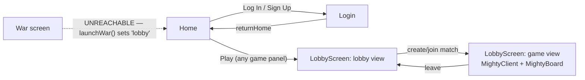

# Frontend Walkthrough (`frontend/`)

A Vite + React 19 SPA. Only runtime dependencies: `react`, `react-dom`, `boardgame.io`.
Entry: [index.html](../frontend/index.html) → [src/main.jsx](../frontend/src/main.jsx) →
[src/App.jsx](../frontend/src/App.jsx). No router library — screens are `useState` state
machines.

## Screen flow

`App.jsx` holds `screen: 'home' | 'loggingIn' | 'war' | 'lobby'`. Note the `'war'` branch
still exists and [War.jsx](../frontend/src/War.jsx) still compiles into the bundle, but
nothing ever sets `screen = 'war'` anymore — both `launchLobby` and `launchWar` go to
`'lobby'` ([App.jsx:57-58](../frontend/src/App.jsx#L57-L58)). The complete, working War game
(vs. the house, via Flask) is one line away from being reachable again. **Decide: revive it
or delete it.**

## Live files, what they do, and what they call

| File | Role | Network |
|---|---|---|
| [main.jsx](../frontend/src/main.jsx) | Entry, mounts `<App/>` | — |
| [App.jsx](../frontend/src/App.jsx) | Screen router, holds `userInfo` | `POST :5000/logout` |
| [Home.jsx](../frontend/src/Home.jsx) | Landing page; hardcoded game panels (War, Mighty, Hearts, …) — every panel's Play goes to the lobby | — |
| [StaticVisuals.jsx](../frontend/src/StaticVisuals.jsx) | `HeaderBanner` (brand bar + auth buttons), shared by Home and Lobby | — |
| [Login.jsx](../frontend/src/Login.jsx) | Login/signup form | `POST :5000/login` or `/signup` |
| [War.jsx](../frontend/src/War.jsx) | Era 1 War game vs the house (608 lines, self-contained, works) | `POST :5000/war/new`, `/war/play`, `/war/quit` |
| [assets/cards/CardFace.jsx](../frontend/src/assets/cards/CardFace.jsx) | Renders one card as `` from `assets/cards/cards_good/*.svg` | — |
| [LobbyComponents/LobbyScreen.jsx](../frontend/src/LobbyComponents/LobbyScreen.jsx) | Lobby orchestration: owns the boardgame.io `LobbyClient`, match/credential state, swaps lobby ⇄ game view | `:8080` lobby REST (`listGames`, `listMatches`, `createMatch`, `joinMatch`, `leaveMatch`) |
| [LobbyComponents/Lobby.jsx](../frontend/src/LobbyComponents/Lobby.jsx) | Lobby dashboard UI: filter dropdown, create button, match grid with seats (polls every 50 s) | via callbacks from LobbyScreen |
| [LobbyComponents/client.jsx](../frontend/src/LobbyComponents/client.jsx) | Builds `MightyClient = Client({game: Mighty, numPlayers: 5, board: MightyBoard, multiplayer: SocketIO})` | socket.io → `:8000` |
| [LobbyComponents/loading_page.jsx](../frontend/src/LobbyComponents/loading_page.jsx) | Card-shuffle spinner while the client connects | — |
| [board/MightyBoard.jsx](../frontend/src/board/MightyBoard.jsx) | 7-line adapter: `<GenericBoard config={MightyBoardConfig}/>` | — |
| [board/MightyBoardConfig.js](../frontend/src/board/MightyBoardConfig.js) | Mighty presentation config: trump-aware hand sort, opponent seat rotation, zone layout | — |
| [LobbyComponents/TestBoard.jsx](../frontend/src/LobbyComponents/TestBoard.jsx) | Debug board (JSON dump of `G` + one move button). Only referenced by **unused** imports — never rendered | — |

CSS: `index.css`, `Home.css`, `Login.css`, `War.css`, `LobbyScreen.css`,
`LobbyComponents/Home.css` (verbatim duplicate of `Home.css`), `loading_page.css`,
`App.css` (**empty file**).

## The lobby → game handshake (worth understanding before refactoring)

1. `LobbyScreen` creates matches / joins via the **lobby REST API on :8080**
   (`lobbyClient.joinMatch` returns `playerCredentials`).
2. Tokens (`matchID`, `playerID`, `credentials`) are stored in `connectionTokens` state.
3. Screen flips to `'game'` and mounts `<MightyClient matchID playerID credentials/>` —
   the boardgame.io `Client` HOC connects to **:8000 over socket.io** and streams `G`/`ctx`
   into `MightyBoard`.

## Known quirks & small bugs

- **`leaveMatch` always fails silently**: `handleLeaveGame` reads
  `connectionTokens.gameName`, but `setConnectionTokens` never stores `gameName`
  ([LobbyScreen.jsx:103](../frontend/src/LobbyComponents/LobbyScreen.jsx#L103)). Seats are
  never freed.
- The game view only handles `activeGame === 'Mighty'`; any other game renders nothing
  (falls through to "Screen not found" only when activeGame is unset).
- `Lobby.jsx`'s join button sends `gameName: createType` (the *create* dropdown value), not
  the game of the match being joined
  ([Lobby.jsx:297](../frontend/src/LobbyComponents/Lobby.jsx#L297)) — joining a match while
  the dropdown shows a different game would join the wrong game's namespace.
- Ports/URLs are hardcoded in four places (`App.jsx`, `Login.jsx`, `War.jsx` → `:5000`;
  `LobbyScreen.jsx` → `:8080`; `client.jsx` → `:8000`). No env vars, no Vite proxy.
- **Dead imports that keep dead code alive**: `client.jsx` imports `GenericBoard`,
  `WarBoard`, `War.js` (from `game-client/`), `game1` (from `card_server/games.js`) and
  `TestBoard` — none are used in that file. `Lobby.jsx` imports `game1`, `TestBoard`,
  `LobbyClient` unused. `App.jsx` imports `CardFace` unused. These lines are why the
  reachability graph drags in the whole Era 2 War game — remove the lines and that code
  becomes deletable (see [06-dead-code.md](06-dead-code.md)).
- Cross-tree imports (the load-bearing ones): `client.jsx` imports **Mighty.js** from
  `backend/card_server` (required — shared game definition) and `MightyBoard.jsx` imports
  **GenericBoard** from `game-client` (required until the engine is moved — see
  [07-refactor-plan.md](07-refactor-plan.md)).

## Dead files inside `frontend/`

| File | Evidence |
|---|---|
| `src/Mighty.jsx` (608 lines) | Imported by nothing. It is `War.jsx` with `War`→`Mighty` renamed (verified byte-identical after substitution) — still calls the `/war/*` API and imports `War.css`. An abandoned "start Mighty by copying War" attempt |
| `src/Mighty.css` (772 lines) | Imported by nothing; byte-identical to `War.css` |
| `src/board/MightyBoard.css` | Imported by nothing — `MightyBoard.jsx` doesn't import it (probably an oversight; decide during refactor whether its styles are wanted) |
| `src/LobbyComponents/main.jsx` | Second copy of the entry file; `index.html` doesn't point at it, and its `./App.jsx` import wouldn't even resolve |
| `src/LobbyComponents/index.css` | Only imported by the dead `main.jsx` above |
| `src/components/AssetPreview.jsx` + `.css` | Dev-only asset gallery; only referenced in comments and `README_ASSETS.md` ("temporarily swap it into App"). Harmless dev tool — keep or delete deliberately |
| `src/assets/animations/cardAnimations.css` | Only imported by AssetPreview |
| `src/LobbyComponents/.LobbyScreen.jsx.swp` | Stale vim swap file |

Also: `frontend/README.md` is untouched Vite boilerplate, and `frontend/README_ASSETS.md`
contains a **stale architecture decision** ("boardgame.io — Not installed at this time") that
directly contradicts the current code — worth rewriting after the refactor.
