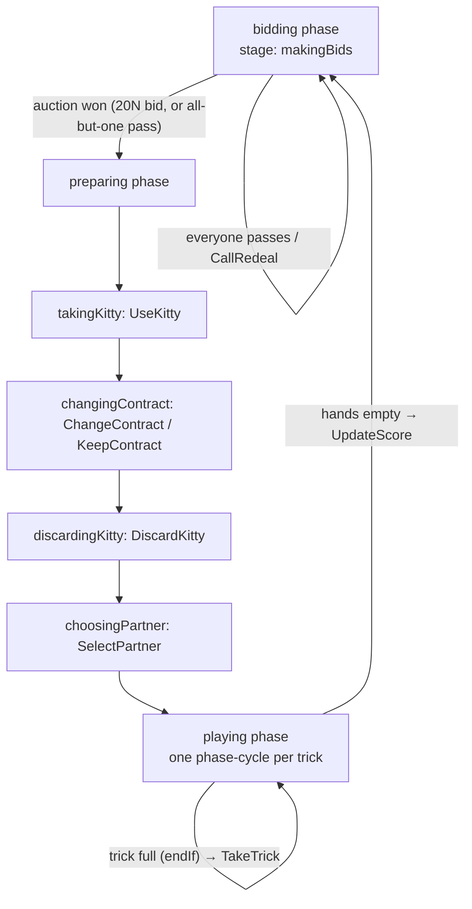

# Mighty — Game Logic Deep Dive

The actual rules of Mighty live in **one file**:
[backend/card_server/GameObjects/Mighty.js](../backend/card_server/GameObjects/Mighty.js)

This file is the heart of the project. Everything else is plumbing around it.

## How the file is used (important!)

The `Mighty` object is a [boardgame.io](https://boardgame.io) game definition. boardgame.io's
design is that **the same game object runs on both the server and the client**:

- The server ([backend/card_server/server.js](../backend/card_server/server.js)) registers it:
  `Server({ games: [Mighty] })` — this is the authoritative copy.
- The frontend ([frontend/src/LobbyComponents/client.jsx](../frontend/src/LobbyComponents/client.jsx))
  imports **the same file** across the repo boundary
  (`import { Mighty } from '../../../backend/card_server/GameObjects/Mighty.js'`) and passes it to
  `Client({ game: Mighty, ... })` — the client uses it for optimistic local prediction.

So the weird-looking cross-tree import is **not an accident — it is the boardgame.io pattern**.
When refactoring, this file should move to a location both sides can import cleanly (e.g. a
`shared/games/` folder or an npm workspace package), but client and server must keep importing
the *same* definition.

## Card & bid encoding

| Thing | Encoding | Examples |
|---|---|---|
| Card | `<RANK><SUIT>` string | `AS` = Ace of Spades, `TC` = Ten of Clubs |
| Ranks | `A 2 3 4 5 6 7 8 9 T J Q K` | `T` = ten |
| Suits | `C H S D` | clubs, hearts, spades, diamonds |
| Joker | `WN` | after the Joker is led and a suit chosen, trick[0] is rewritten to `W<suit>` |
| Bid / contract | `<NN><SUIT-or-N>` string | `14S` = 14 tricks, spades trump; `20N` = 20 no-trump; `P` = pass |
| Special cards | stored in `G` | `G.Mighty = "AS"`, `G.Joker = "WN"`, `G.JokerKiller = "3C"` |

Deck = 52 cards + 1 joker = 53. Five players × 10 cards = 50 dealt; the remaining **3 cards are
the kitty** (kept in `G.deck` after dealing).

## Game state (`G`)

Created in `setup()` ([Mighty.js:59-99](../backend/card_server/GameObjects/Mighty.js#L59-L99)):

| Field | Meaning |
|---|---|
| `deck` | Undealt cards; after dealing, this is the 3-card kitty |
| `hands[i]` | Array of card strings per seat (index 0–4) |
| `piles[i]` | Cards won in tricks (plus the declarer's discarded kitty cards) |
| `trick` | Cards played to the current trick, in play order |
| `bids` | All bids made this auction (with `"P"` padding for skipped players) |
| `contract` | Current highest bid, e.g. `"14S"`. Starts at sentinel `"00C"` |
| `declarer` | Player ID who won the auction |
| `partnerCard` | Card named by declarer to pick a partner (`null` = playing alone) |
| `previousPartner` | **Overloaded field — see below** |
| `dealer` | Seat that dealt (randomized first hand, then previous declarer) |
| `scores[i]` | Running score per seat |
| `killJoker` | Set when the Joker-killer (`3C`) is led and its player chooses to kill the Joker |
| `winnerOfPreviousTrick` | Player ID who leads the next trick |
| `playerNames` | Declared but never populated |

### `previousPartner` is triple-overloaded

This one field means three different things at different times, which is the single most
confusing thing in the file. It serves as:

1. **First bidder** of the next auction (`turn.order.first` in the bidding phase).
2. **The actual partner** of the current round (set by `SelectPartner`, read by `UpdateScore`).
3. **The redeal caller** (set by `CallRedeal`).

A refactor should split this into `firstBidder` and `partner`.

## Phase flow

### `bidding` ([Mighty.js:101-174](../backend/card_server/GameObjects/Mighty.js#L101-L174))
`onBegin` resets round state, builds and shuffles the 53-card deck (`createDeck`), deals 10 cards
to each of 5 players, leaves 3 in `G.deck` as the kitty, and picks the dealer (random first hand,
previous declarer afterwards). Moves:
- **MakeBid(bid)** — validates against the current contract (must raise the number, or match it
  going to no-trump; capped 13–20). `"20N"` wins the auction instantly. When all but one player
  have passed, that player becomes `G.declarer` and the phase ends. Skipped (already-passed)
  players get `"P"` padding pushed into `G.bids` so the seat/bid alignment survives.
- **CallRedeal()** — only allowed before 5 bids exist; restarts the bidding phase (fresh deal)
  and makes the caller the next first bidder.

### `preparing` ([Mighty.js:176-220](../backend/card_server/GameObjects/Mighty.js#L176-L220))
Declarer-only phase, four stages in sequence:
- **UseKitty** — declarer picks up the 3 kitty cards (hand is now 13).
- **ChangeContract(bid) / KeepContract** — declarer may raise their own contract after seeing
  the kitty (jump of 2, or 1 when moving to no-trump / from 19, or same-suit raise).
- **DiscardKitty(cards)** — declarer discards 3 cards into their own pile (these count toward
  points at scoring; standard Mighty rule).
- **SelectPartner(card)** — declarer names a card; whoever holds it is silently the partner
  (`null` = playing alone). Sets `G.previousPartner` to the partner's ID.

### `playing` ([Mighty.js:221-267](../backend/card_server/GameObjects/Mighty.js#L221-L267))
One trick per **phase cycle**: `endIf` fires when `trick.length === numPlayers`, `onEnd` scores
the trick (`TakeTrick`) and either loops back into `playing` (next trick) or, when hands are
empty, runs `UpdateScore` and returns to `bidding` for the next hand. Moves:
- **PlayCard(card)** — the core move. Validation: card must be in hand; the first lead of the
  hand cannot be trump (unless no-trump); Mighty and Joker can always be played; follow suit if
  able; if the Joker-killer was led with `killJoker` set, the Joker holder must play the Joker.
  Side effects: leading the Joker enters the `choosingJokerSuit` stage; leading the `3C` (when
  the Joker is still out) enters the `killingJoker` stage.
- **JokerSuit(suit)** — after leading the Joker, declare which suit the trick is in
  (rewrites `trick[0]` to `W<suit>`).
- **KillJoker(kill)** — the `3C` was led; a non-Joker-holder confirms whether the Joker is
  killed this trick (a killed Joker loses its trick-winning power).

### Trick resolution — `TakeTrick` ([Mighty.js:290-322](../backend/card_server/GameObjects/Mighty.js#L290-L322))
Winner priority: **Mighty (`AS`)** beats everything → **Joker** (unless killed via `3C` lead) →
highest **trump** → highest card of the **led suit**.

### Scoring — `UpdateScore` ([Mighty.js:325-378](../backend/card_server/GameObjects/Mighty.js#L325-L378))
Counts point cards (10/J/Q/K/A) collected by declarer + partner, compares to the contract
number, computes a `gameScore` with multipliers (made-20, bid-20, playing alone, under-10), then
applies: declarer ×2 (×4 alone), partner ×1, opponents −1 each.

## Known bugs (verified against boardgame.io 0.50 semantics)

These are listed so the refactor knows what is *broken* vs *working*. The bidding and preparing
phases largely work; **the end-of-trick path is where the game currently falls over.**

### Crashers
1. **`playing.onEnd` has the wrong signature and calls missing functions**
   ([Mighty.js:257-265](../backend/card_server/GameObjects/Mighty.js#L257-L265)):
   `onEnd: (G, ctx) => {...}` — boardgame.io passes a *single* `{G, ctx, events}` object, so `G`
   is actually the whole context and `ctx` is `undefined`. Inside it: `TakeTrick()` is called
   with **no arguments** (it destructures `{G, ctx}` → TypeError), `UpdateScores()` doesn't
   exist (the function is named `UpdateScore`), and `events` is not in scope.
   **Net effect: completing the 5th card of a trick crashes.** This is the #1 fix.
2. **Undeclared loop variable in `PlayCard`**
   ([Mighty.js:413](../backend/card_server/GameObjects/Mighty.js#L413)): `for (i = 0; ...)` — `i`
   is never declared; ES modules run in strict mode, so leading the `3C` mid-hand throws a
   ReferenceError.
3. **Undeclared variables in `UpdateScore`**
   ([Mighty.js:359-365](../backend/card_server/GameObjects/Mighty.js#L359-L365)):
   `declarerScore` / `opponentScore` / `partnerScore` have no `let`/`var` → ReferenceError in
   strict mode (would crash scoring even if bug #1 were fixed).

### Wrong-result bugs
4. **`TakeTrick` confuses trick position with seat index**
   ([Mighty.js:320-321](../backend/card_server/GameObjects/Mighty.js#L320-L321)): `winner` is an
   index *into the trick* (which starts from the trick leader), but is used to index `G.piles`
   and `ctx.playOrder` directly. Correct only when seat 0 leads. Needs
   `(leaderPos + winner) % numPlayers`.
5. **Follow-suit is never enforced**
   ([Mighty.js:401](../backend/card_server/GameObjects/Mighty.js#L401)):
   `G.hands[...].filter(...) > 0` compares an **array** to a number — always `false`, so the
   follow-suit branch never runs.
6. **Joker can't be played when it's been killed**
   ([Mighty.js:398](../backend/card_server/GameObjects/Mighty.js#L398)):
   `(card !== "WN" || card !== G.Mighty)` is always `true` (should be `&&`), so when the Joker
   holder tries to comply and play the Joker, the move is rejected — soft-lock.
7. **Point counting counts nothing**
   ([Mighty.js:333](../backend/card_server/GameObjects/Mighty.js#L333)):
   `VALUES.indexOf(c.slice(0))` — `c.slice(0)` is the *whole* card string (`"AS"`), never found
   in `VALUES`, so `collectedPoints` is always 0.
8. **Lost multiplier** ([Mighty.js:354](../backend/card_server/GameObjects/Mighty.js#L354)):
   `gameScore * 2` — result never assigned.
9. **`G.playOrder` doesn't exist**
   ([Mighty.js:369-371](../backend/card_server/GameObjects/Mighty.js#L369-L371)): should be
   `ctx.playOrder` — scoring would assign to nobody.
10. **`.lenth` typo in `SelectPartner`**
    ([Mighty.js:553](../backend/card_server/GameObjects/Mighty.js#L553)): the
    "partner card is in the kitty → declarer plays alone" check never fires.

### Cosmetic / structural oddities
- `minPlayers: 5, maxPlayers: 5` inside each phase ([Mighty.js:103](../backend/card_server/GameObjects/Mighty.js#L103) etc.)
  are **not** boardgame.io phase options — they're ignored. Player count actually comes from
  `numPlayers: 5` in [client.jsx](../frontend/src/LobbyComponents/client.jsx) and the lobby's
  `createMatch` call.
- `G.bids = [],` ([Mighty.js:116](../backend/card_server/GameObjects/Mighty.js#L116)) — stray
  comma operator (harmless).
- ~50 lines of commented-out helper functions at the top of the file reference a
  `./BoardResources_test.js` module that doesn't exist (only `BoardResources_test.jsx`, itself
  unused). Safe to delete.
- `G.playerNames`, `G.dealer`, and the `canWin` array in `TakeTrick` are written but never
  meaningfully read.
- `debug: true` on the game object and `debug: true` on the client — turn off for production.

## Where the UI meets the logic

- [frontend/src/board/MightyBoardConfig.js](../frontend/src/board/MightyBoardConfig.js) —
  presentation config: sorts the hand trump-aware, maps card strings to `{id, rank, suit}`
  objects, rotates opponents relative to your seat, and declares the table zones
  (opponent hands top/flanks, trick + kitty center, your hand + tricks-won bottom).
- Its `moveMap` maps UI events to game moves: `playCard → 'PlayCard'`, and
  `discardCard → 'DiscardToKitty'` — **note `DiscardToKitty` does not exist** in Mighty.js
  (the move is `DiscardKitty`), so discarding from the UI silently can't work yet.
- The rendering engine is `GenericBoard` from the legacy tree — see
  [04-generic-board.md](04-generic-board.md).
- There is **no UI yet for bidding, kitty, partner selection, or joker stages** — the board
  config only wires `PlayCard`/discard. The friend's next milestone is presumably wiring the
  bidding/preparing phases into the board (the `ActionZone` in GenericBoard is the natural place).
