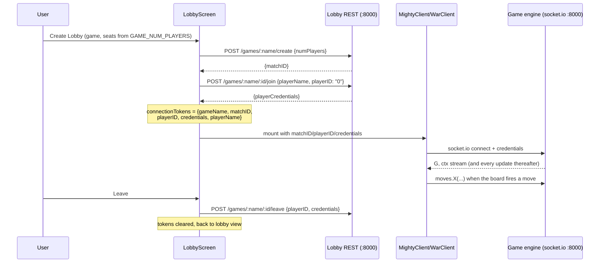

# The Lobby & Game Clients — how a match starts, runs, and ends

The plumbing between "I clicked Play" and "I'm looking at a board with live game state".
Four files in [frontend/src/LobbyComponents/](../../frontend/src/LobbyComponents/), each
with one job:

| File | Job |
|---|---|
| [LobbyScreen.jsx](../../frontend/src/LobbyComponents/LobbyScreen.jsx) | **The owner.** Holds the boardgame.io `LobbyClient`, the connection tokens, and the lobby ⇄ game view switch |
| [Lobby.jsx](../../frontend/src/LobbyComponents/Lobby.jsx) | **The dashboard UI.** Filter dropdown, create controls, the match grid. Pure presentation — all network work arrives as callback props from LobbyScreen |
| [client.jsx](../../frontend/src/LobbyComponents/client.jsx) | **The game clients.** Builds `MightyClient` and `WarClient` with the boardgame.io `Client()` HOC; exports `GAME_NUM_PLAYERS` (seats per game: Mighty 5, War 1) |
| [loading_page.jsx](../../frontend/src/LobbyComponents/loading_page.jsx) | The spinner boardgame.io shows while the socket connects |

Framework background: [boardgame-io.md](../boardgame-io.md#the-server-side-and-the-lobby).

## The full lifecycle

Key details:

- **`connectionTokens`** is the only state that crosses from lobby-world to game-world:
  `{gameName, matchID, playerID, credentials, playerName}`. `credentials` is the per-seat
  secret from `joinMatch` — the engine rejects moves without it, which is what stops one
  browser from playing another seat's cards.
- **Joining an existing match** goes through the same `handleGameStart` as create — the
  match grid's "Take Seat" button passes the match's own `gameName` and `matchID`.
- **The view switch**: `screen === 'game'` renders `MightyClient` or `WarClient` based on
  `activeGame`. Adding a game means adding one more branch here (checklist below).
- **Match discovery**: `Lobby.jsx` calls `handleLoadAllGames(filter)` on mount and every
  50 s (`'all'` fans out `listMatches` across every game from `listGames`). 50 s is
  probably a typo for 5 s — refresh is slow; on the quirk list.

## Login gating

`LobbyScreen.confirmLogin()` runs before create/join: if `userInfo.userName` is missing
it opens the login screen instead. The lobby is otherwise browsable logged-out.

## Adding a new game to the lobby (checklist)

1. Define the game in `shared/games/YourGame.js` (see
   [boardgame-io.md](../boardgame-io.md#the-game-object); use local `bgio-constants.js`
   for `INVALID_MOVE` — no package imports in `shared/`).
2. Register it on the server: add to `games: [...]` in
   [server.js](../../backend/card_server/server.js).
3. Create a board config + wrapper under `frontend/src/board/yourgame/` (copy the War
   pair — it's the minimal working example).
4. In [client.jsx](../../frontend/src/LobbyComponents/client.jsx): build a
   `YourGameClient` and add the game's seat count to `GAME_NUM_PLAYERS`.
5. In [LobbyScreen.jsx](../../frontend/src/LobbyComponents/LobbyScreen.jsx): add the
   `activeGame === 'YourGame'` branch.

The lobby dropdowns need no changes — game lists come from the server's `listGames()`.

## Known quirks (still open)

- **Everyone joins as seat 0**: `handleGameStart` defaults `playerID = "0"` and callers
  never pass a seat, so the second person joining a Mighty match collides with the host.
  Fix: pick the first seat with no `name` from the match metadata the grid already has.
- Base URLs are hardcoded (`http://localhost:8000` here, in `client.jsx`, `App.jsx`,
  `Login.jsx`) — one config module is roadmap step 7.
- `Lobby.jsx`'s `findAllGames` (refresh the game-type dropdown from the server) is
  defined but never called — the dropdown uses the hardcoded initial
  `["Mighty", "War"]` until something invokes it.
