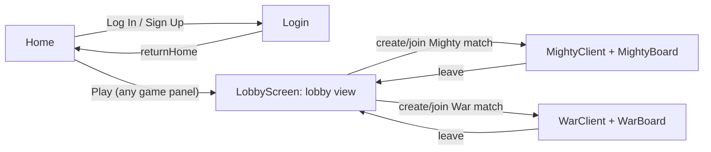

# Frontend Walkthrough (`frontend/`)

> Updated 2026-08-06 after the cleanup: the board engine now lives at `src/engine/`, War is
> a lobby game like Mighty, and every backend call targets the single server on port 8000.

A Vite + React 19 SPA. Runtime dependencies: `react`, `react-dom`, `boardgame.io`.
Entry: [index.html](../../frontend/index.html) → [src/main.jsx](../../frontend/src/main.jsx) →
[src/App.jsx](../../frontend/src/App.jsx). No router library — screens are `useState` state
machines.

## Screen flow

## Live files and what they call

| File | Role | Network |
|---|---|---|
| [main.jsx](../../frontend/src/main.jsx) | Entry, mounts `<App/>` | — |
| [App.jsx](../../frontend/src/App.jsx) | Screen router (`home` / `loggingIn` / `lobby`), holds `userInfo` | `POST :8000/logout` |
| [Home.jsx](../../frontend/src/Home.jsx) | Landing page; hardcoded game panels — every Play goes to the lobby | — |
| [StaticVisuals.jsx](../../frontend/src/StaticVisuals.jsx) | `HeaderBanner` (brand bar + auth buttons) | — |
| [Login.jsx](../../frontend/src/Login.jsx) | Login/signup form | `POST :8000/login` or `/signup` |
| [assets/cards/CardFace.jsx](../../frontend/src/assets/cards/CardFace.jsx) | Renders a card as `` from `assets/cards/cards_good/*.svg`. **Currently orphaned** — the engine's own [Card.jsx](../../frontend/src/engine/components/Card.jsx) does the same job against the same SVGs (see [engine-reference.md](engine-reference.md)); consolidating the two renderers is a good future task. Kept deliberately, with the SVG assets | — |
| [LobbyComponents/LobbyScreen.jsx](../../frontend/src/LobbyComponents/LobbyScreen.jsx) | Lobby orchestration: `LobbyClient`, match/credential state, swaps lobby ⇄ game view (`Mighty` → `MightyClient`, `War` → `WarClient`) | lobby REST on `:8000` |
| [LobbyComponents/Lobby.jsx](../../frontend/src/LobbyComponents/Lobby.jsx) | Lobby dashboard UI: filter, create button (seat count from `GAME_NUM_PLAYERS`), match grid (polls every 50 s) | via callbacks |
| [LobbyComponents/client.jsx](../../frontend/src/LobbyComponents/client.jsx) | Builds `MightyClient` (5 seats) and `WarClient` (1 seat) from the shared game definitions + boards; exports `GAME_NUM_PLAYERS` | socket.io → `:8000` |
| [LobbyComponents/loading_page.jsx](../../frontend/src/LobbyComponents/loading_page.jsx) | Connecting spinner for the bgio client | — |
| [board/MightyBoard.jsx](../../frontend/src/board/MightyBoard.jsx) + [MightyBoardConfig.js](../../frontend/src/board/MightyBoardConfig.js) | Mighty board = GenericBoard + config (trump-aware sort, seat rotation, zones) | — |
| [board/war/WarBoard.jsx](../../frontend/src/board/war/WarBoard.jsx) + [WarBoardConfig.js](../../frontend/src/board/war/WarBoardConfig.js) + [WarAI.js](../../frontend/src/board/war/WarAI.js) | War board = GenericBoard + config (deck click → `playCard`; WarAI holds display constants) | — |
| [engine/](../../frontend/src/engine/) | The GenericBoard rendering engine — see [04-generic-board.md](board-engine.md) | chat hooks POST to a dead `:5000` URL (to be stripped) |

## The lobby → game handshake

1. `LobbyScreen` creates/joins matches via the lobby REST API (`joinMatch` returns
   `playerCredentials`).
2. Tokens (`gameName`, `matchID`, `playerID`, `credentials`) are stored in
   `connectionTokens` state.
3. The screen flips to the game view and mounts the matching client
   (`MightyClient` / `WarClient`); the boardgame.io `Client` HOC connects over socket.io
   and streams `G`/`ctx` into the board.

## Known quirks still open

- **Everyone joins as seat 0**: `handleGameStart` defaults `playerID="0"` and the join
  button never passes a seat, so a second player joining a Mighty match will collide with
  the host's seat. Needs "first free seat" logic before real multiplayer testing.
- Ports/URLs are hardcoded (now consistently `:8000`, but still in four places) — a small
  config module is step 7 of the refactor plan.
- `Lobby.jsx` polls the match list every 50 s (`50000` ms — probably meant 5 s).
- `App.css` is an empty file; `Home.css` exists verbatim in two places (`src/` and
  `src/LobbyComponents/`) and both copies load.
- `frontend/README.md` is Vite boilerplate and `README_ASSETS.md` still contains stale
  Era 1 claims ("boardgame.io — not installed") — rewrite in the docs truth pass.

## Fixed/removed in the 2026-08 cleanup

For the record (details in [06-dead-code.md](../project/dead-code.md)): the dead files
(`Mighty.jsx`/`Mighty.css` War-clones, duplicate entry files, `TestBoard`, Era 1
`War.jsx`/`War.css` and the unreachable `war` screen), the unused imports that kept them
alive, the join-uses-dropdown-game bug, and the missing `gameName` in `connectionTokens`
that broke `leaveMatch`.
